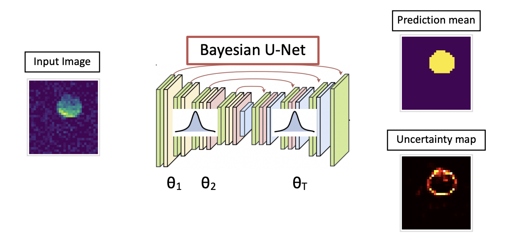
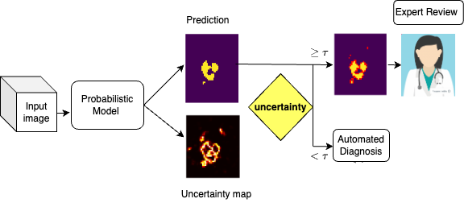

# UQ_LSN_19F
This repository provides implimentation in PyTorch for the paper "Quantifying model uncertainty for semantic segmentation of Fluorine-19 MRI using stochastic gradient MCMC". 

Bayesian U-Net             |   Integration of Uncertainty in Clinical Workflow
:-------------------------:|:-------------------------:
  |  

**Approach**: The paper presents an innovative approach that integrates a Bayesian method based on MCMC methods into the UNet architecture for semantic segmentation of low signal-to-noise ratio (SNR) 19F MRI data. Detecting 19F MRI signals is crucial for studying various diseases and treatments, but the challenges posed by the low SNR necessitate computational methods for reliable detection and segmentation. Our proposed Bayesian Deep Learning model significantly enhances sensitivity in 19F MRI segmentation while also providing uncertainty maps to identify prediction failures. These uncertainty maps facilitate the investigation of regions with high uncertainties, aiding experts in refining segmentation results. This GitHub repository hosts the implementation of our Bayesian Deep Learning model, providing researchers with tools to improve 19F MRI segmentation accuracy and interpretability. 

**Accepted in:** Computer Vision and Image Understanding

https://doi.org/10.1016/j.cviu.2024.103967

### Installation:

Install requirements e.g. via 

`pip install -r requirements.txt`

Install UQ_LSN_19F module via

`pip install .`

### Usage:

To train the model, run the code in `train.py`. You can simply run the following:

`python UQ_LSN_19F/train.py`

It will run code with default parameters, and save chekpoints in `ckpts` folder.

To test the model, use `test.py`. You can simply run the following code:

`python UQ_LSN_19F/test.py`

### Data:
For training the model we used both synthetic data and real data that can be found in the folder `Data` under `realData` and `artificialData`. For test set we only used real data that we uploaded in `testrealData` in `Data`.

